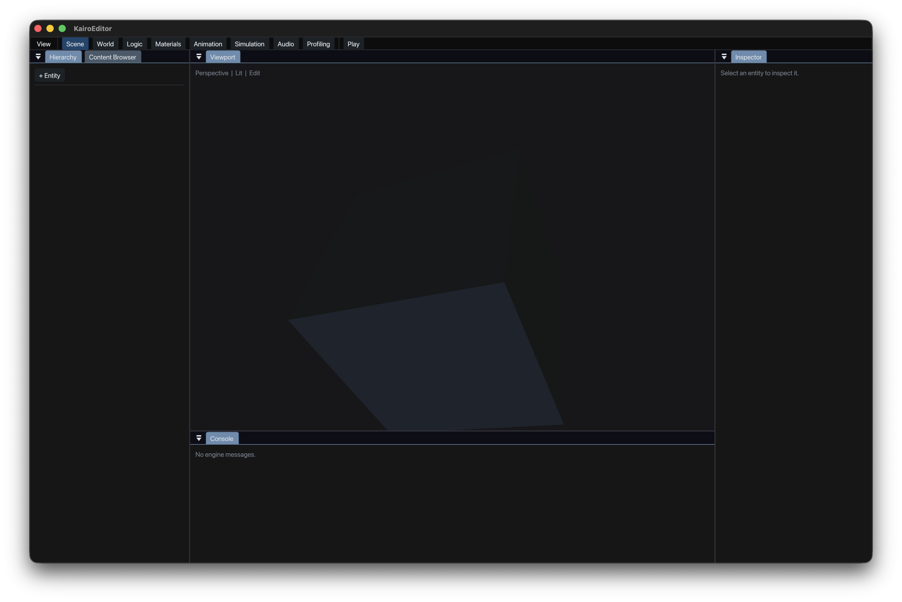

# KairoEditor

`KairoEditor` is the authoring layer for Kairo scenes. It is intentionally a
separate repository from `KairoEngineCore`: EngineCore runs scenes, while the
editor owns selection, workspace state, inspection, and play/edit transitions.



```text
KairoMath -> KairoEngineCore -> KairoEditor
                           -> KairoRenderer (viewport backend)
                           -> KairoPhysicsEngine (play-mode backend)
```

The current foundation provides a tested, backend-neutral editor state model:

- validated entity selection and stale-selection recovery
- edit, play, pause, resume, and stop state transitions
- persistent visibility state for hierarchy, inspector, viewport, content,
  console, and statistics panels
- task-focused Scene, World, Logic, Materials, Animation, Simulation, Audio,
  and Profiling workspaces
- Code, Graph, and synchronized Code + Graph authoring surfaces
- bounded cross-surface command history with causal undo/redo branching
- reversible entity creation, deletion, rename, and complete transform edits

The visual direction is viewport-first and production-dense: low-chrome dark
panels, a strong central canvas, rich inspectable nodes, timeline/curve tools,
and focused workspace presets. See [docs/EDITOR_PRODUCT_SPEC.md](docs/EDITOR_PRODUCT_SPEC.md).

`KairoEditorApp` is the first native shell milestone. It uses the official
Dear ImGui docking release, KairoRenderer's existing Vulkan device/render pass,
the Kairo neutral theme, curated docking, workspace controls, live hierarchy
selection, transform inspection, play controls, and runtime UI statistics.
The editor never creates a second Vulkan device or render pass; ImGui records
through the renderer's validated tooling-overlay contract.

The native host also contains a narrow `KairoEditorRendererBridge` boundary.
It validates typed EngineCore asset handles against a live `KairoAssets`
registry, then resolves registered mesh IDs to renderer-owned GPU handles and
extracts visible entities every frame. The hierarchy, transform inspector, and
viewport therefore operate on one scene instead of disconnected demo data.
The starter cube is loaded from a committed project descriptor, asset manifest,
and scene file using the explicit `builtin/cube` metadata record with a
persistent UUID; it is not hidden inside KairoRenderer and remains valid if its
logical path moves.

## Project sessions

The editor opens versioned `.kproject` descriptors instead of constructing a
hardcoded startup scene. A descriptor points to one validated KairoAssets
manifest and startup `.kscene` using project-root-relative portable paths:

```text
kairo-project 1
name "Kairo Starter Project"
assets "Assets.kassets"
startup-scene "Scenes/Main.kscene"
```

`ProjectSession` owns the address-stable scene and asset registry used by editor
state, persistence, the Content Browser, and renderer extraction. Project and
scene replacement reject unsaved work unless the caller explicitly chooses the
discard policy. New projects are built in a unique sibling staging directory
and published by directory rename; descriptors, manifests, and scenes each use
atomic same-directory replacement.

The native File menu saves the active scene or all dirty project data, and
`Cmd+S`/`Ctrl+S` saves the scene. This milestone accepts project paths through
`--project`; native create/open dialogs will call the same session API rather
than introducing another persistence path.

## Commands and undo

`CommandHistory` is independent from Dear ImGui and owns a bounded linear
journal. A successful edit after undo removes the obsolete redo branch;
continuous name and transform changes merge into one user operation. Failed
command execution does not advance or truncate history. The native Edit menu
shows the next command name and supports `Cmd/Ctrl+Z` and
`Cmd/Ctrl+Shift+Z`.

Hierarchy and Inspector edits use concrete scene commands. Entity deletion
captures the stable entity ID, name, transform, mesh renderer, camera, rigid
body binding, and collider binding, then restores that complete authored state
on undo. Commands retain a `ProjectSession` reference, so a host must clear its
history before replacing or closing that session; the native host currently
opens one project for its process lifetime.

Code, Graph, and Split are views over one future authored-document model, not
independent sources of truth. The current shell exposes the workspace and panel
contracts without pretending that the typed graph compiler already exists.

## Build and run

```bash
cmake -S . -B build -G Ninja -DCMAKE_CXX_COMPILER=/opt/homebrew/opt/llvm/bin/clang++
cmake --build build
ctest --test-dir build --output-on-failure
./build/KairoEditorApp \
  --project examples/StarterProject/Project.kproject
```

Appending `--frames 3` runs a bounded native smoke session used by CTest to
verify project loading, asset resolution, initialization, frame recording,
presentation, and orderly shutdown.

For CI or consumers that only need the backend-neutral editor state library:

```bash
cmake -S . -B build-headless -G Ninja \
  -DCMAKE_CXX_COMPILER=/opt/homebrew/opt/llvm/bin/clang++ \
  -DKAIRO_EDITOR_BUILD_APP=OFF
cmake --build build-headless
ctest --test-dir build-headless --output-on-failure
```

The application requires GLFW, Vulkan headers, and a Vulkan loader. On macOS,
the renderer runs through MoltenVK. CMake prefers sibling `KairoEngineCore` and
`KairoRenderer` checkouts and falls back to their GitHub repositories.
